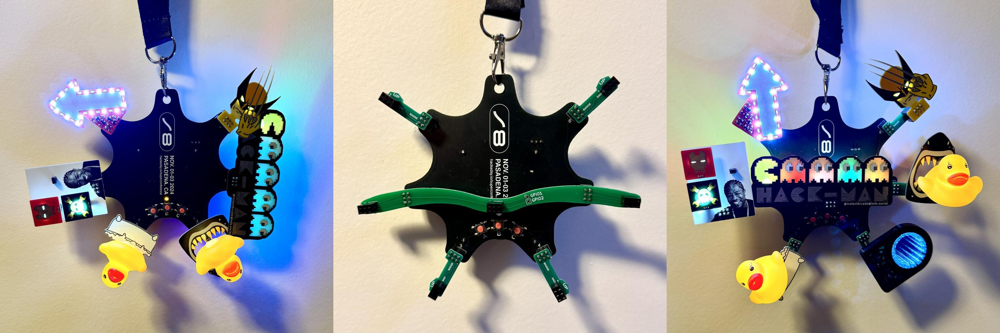

We love the [Hackaday Supercon 8 Add On Badge](https://github.com/Hack-a-Day/2024-Supercon-8-Add-On-Badge),
but in our opinion it has two major design flaws:
1. 4 out of 6 SAO slots are oriented sideways or upside-down
2. there is a large empty area in the center of the badge

We present two simple adapters to solve these issues.

(see note below for links to the SAOs shown)

**SAO Up** rotates the SAO slot by 90 degrees, orienting SAOs closer to
their upright position. The same PCB works for the left and right side
of the badge, depending on which side the SAO headers are soldered.

**SAO Bridge** adds an SAO slot in the center of the badge, and also
rotates the left and right SAO slots into upright orientation. The center
slot is connected to power and I2C of the bus on the left side of the
badge (slot 2).

Black would have been the logical color for the adapters. But we only had
10 days between [badge reveal](https://hackaday.com/2024/10/22/the-2024-hackaday-supercon-sao-badge-reveal/)
and the event, so we went with green as that offered the fastest
turnaround time at JLCPCB.

You are welcome to duplicate, adapt or steal this project. The license is
CERN-OHL-P, which is open and permissive.

**SAOs used for demo**

Here's a list of the SAOs shown in the photos above:
* [duckGLOW](https://hackaday.io/project/198918-duckglow-sao)) by myself
* [Hack-Man](https://hackaday.io/project/198301-hack-man-sao) by InstantArcade
* [Featuring You!](https://hackaday.io/project/198924-featuring-you) by Nanik Adnani
* [Yo Dawg](https://hackaday.io/project/198060-yo-dawg-sao-introducing-saoao) by davedarko
* [Infinity Mirror](https://hackaday.io/project/198943-sao-infinity-mirror) by Scorch Works
* [Wolverine](https://mastodon.social/@simenzhor/113266947534371773) by Simen E. Sørensen
